# 🌟 Web Development Projects Showcase  

Welcome to my collection of **Elevvo Frontend Tasks** where I explored HTML, CSS, JavaScript, React, and responsive design.  
Each task has its own unique theme — from personal blogging to productivity apps!  

---

## 📂 Projects  

### **📂 Panel (Collapsible Sidebar)**  
**What it is:**  
A stylish sidebar called **Panel** that smoothly slides in and out.  
- Logo placeholder at the top  
- 4–5 navigation links with icons  
- Toggle button to open/close  
- Responsive for mobile  

**Built with:** HTML, CSS, JavaScript  

**Screenshot:**  
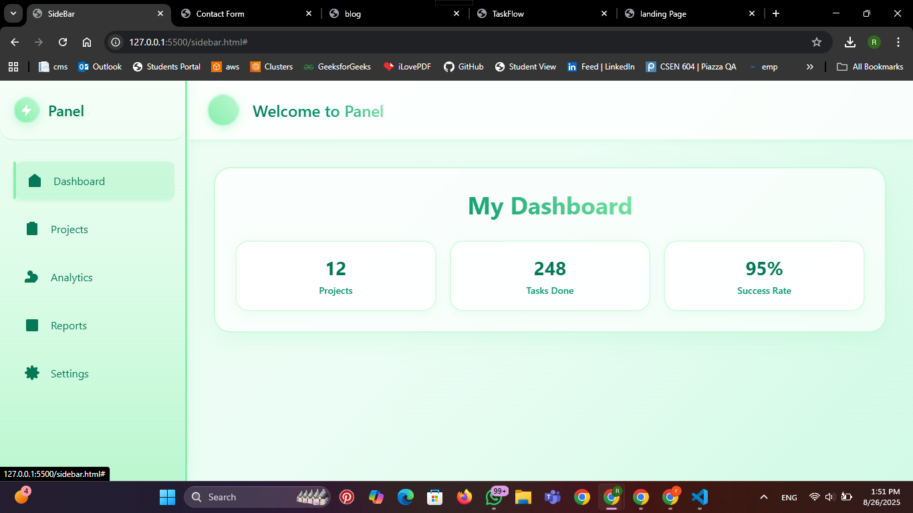  

---

### **📧 Contact Form**  
**What it is:**  
A clean, mobile-friendly **Contact Form** for sending messages.  
- Fields: Full Name, Email, Subject, Message  
- Responsive design for all devices  
- Includes basic validation (required fields, email format)  

**Built with:** HTML, CSS, JavaScript  

**Screenshot:**  
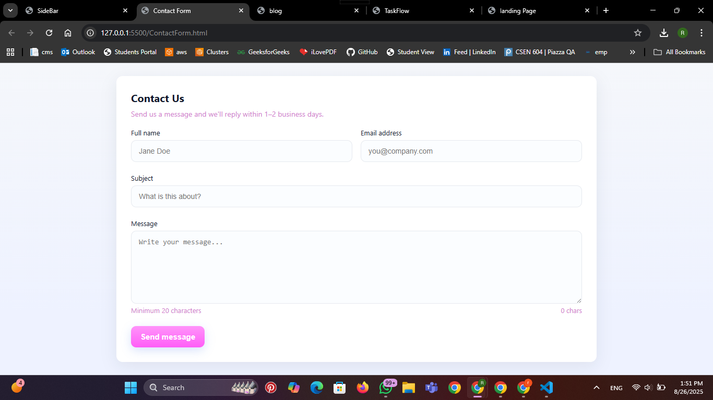  

---

### **✅ TaskFlow (Task App Website)**  
**What it is:**  
A one-page website for **TaskFlow**, a fictional app that helps people stay organized.  
- Hero section with app name + CTA  
- Features with icons  
- User testimonials  
- Pricing plans  
- Footer with contact links & social icons  

**Built with:** HTML, CSS/Tailwind, JavaScript  

**Screenshot:**  
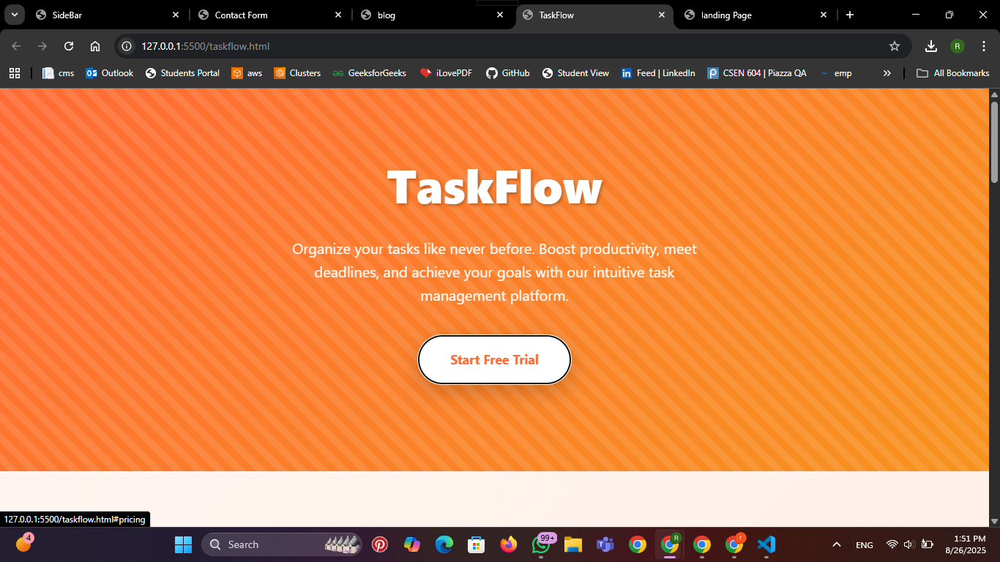  
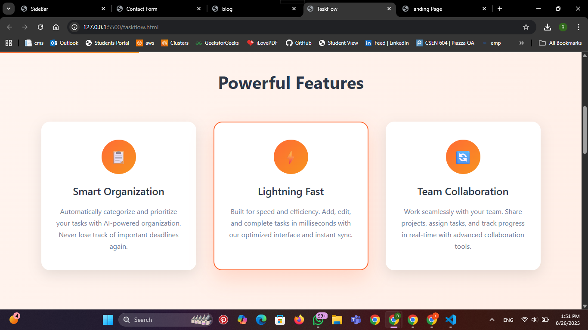  
  
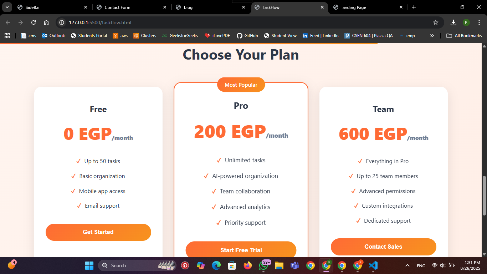  
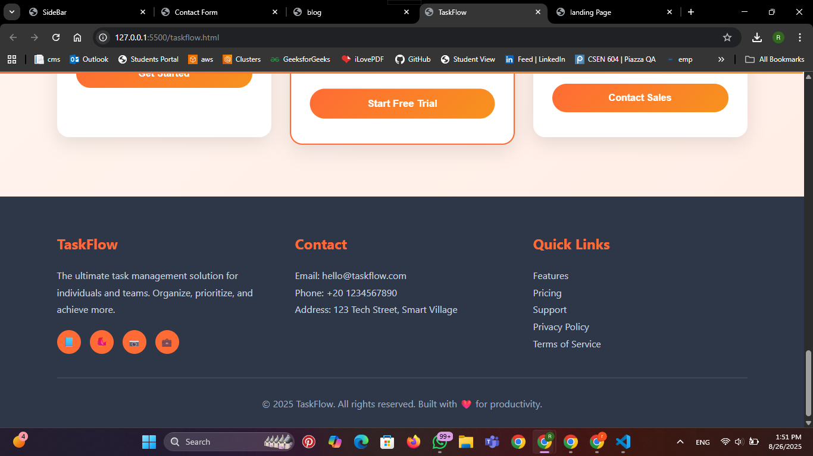  
---

### **📝 Rana’s Blog (Personal Blog Homepage)**  
**What it is:**  
My very own **Rana’s Blog** homepage, showcasing stories about tech, travel, and food.  
- Header with blog title  
- Blog post cards with title, image, description, and date  
- Category filters (Tech, Travel, Food)  
- Search bar to filter posts by keyword  
- Pagination (show limited posts per page)  

**Built with:**  HTML, CSS/Tailwind, JavaScript  

**Screenshot:**  
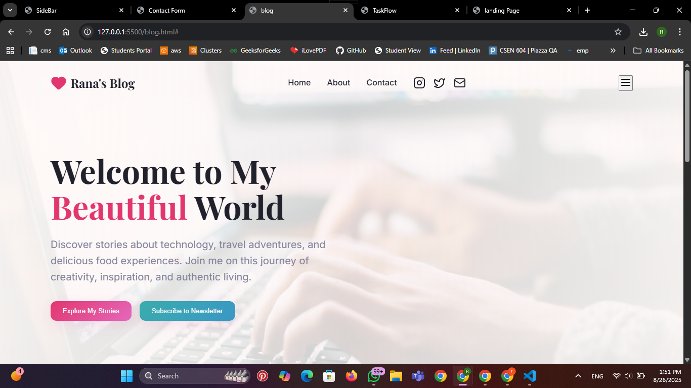  
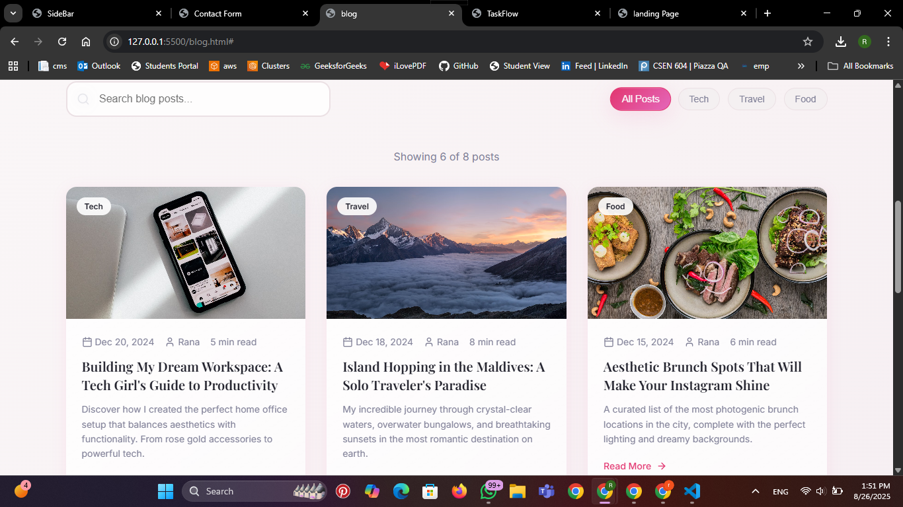  
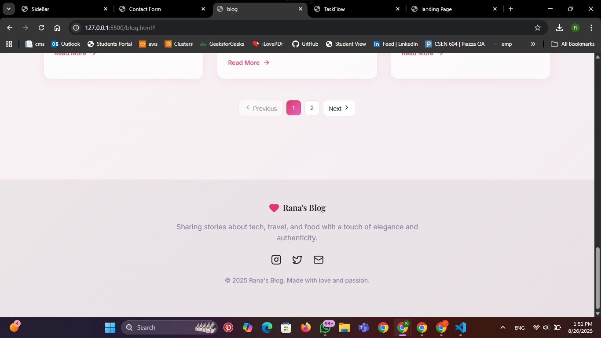  

---

### **☁️ CloudSync Pro (Landing Page)**  
**What it is:**  
A sleek marketing landing page for **CloudSync Pro**, a fictional SaaS tool.  
- Sections: Hero, Features, Testimonials, Pricing, Call-to-Action  
- Fully responsive for mobile, tablet, and desktop  
- Clean grid layout  
- Bonus: Dark/Light theme toggle  

**Built with:** HTML, CSS, JavaScript, Flexbox/Grid, Tailwind/Bootstrap  

**Screenshot:**  
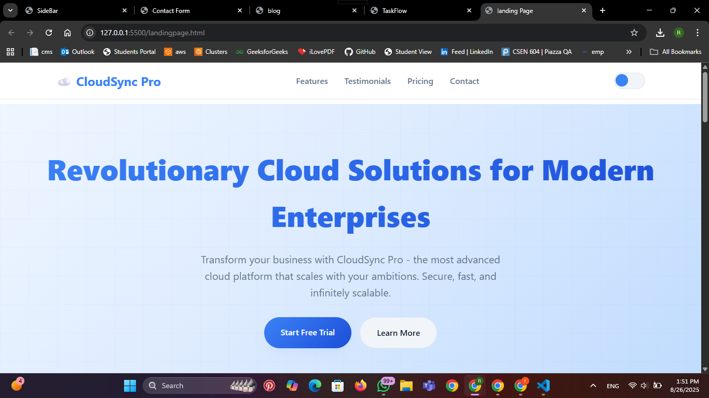  
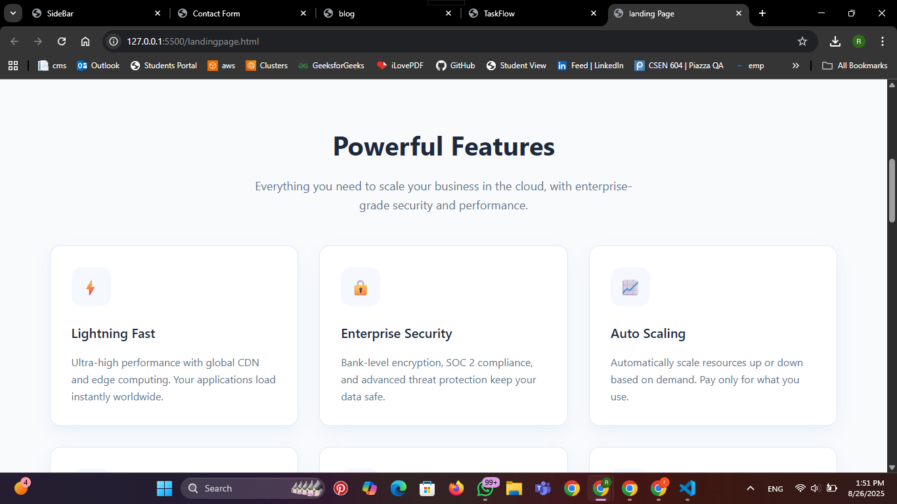  
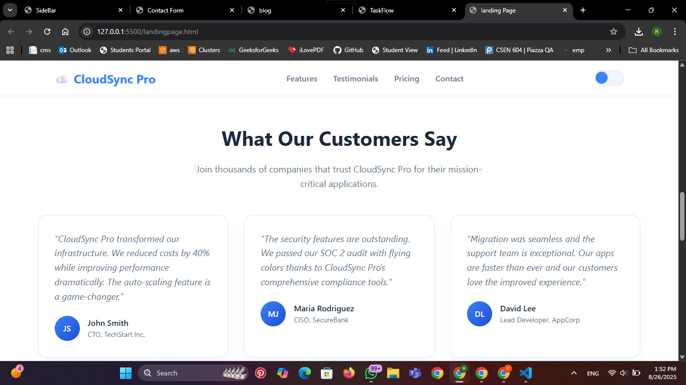  
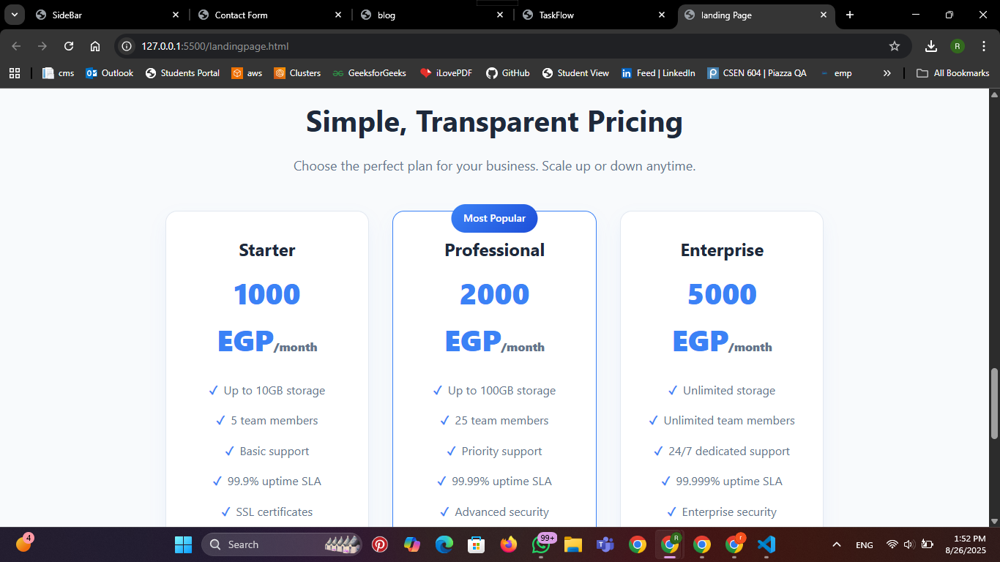  
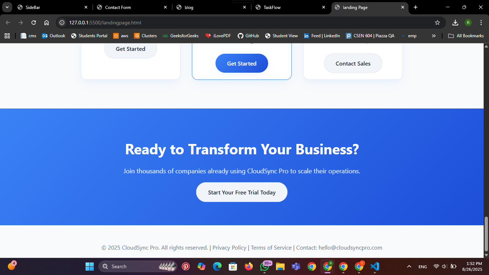  
  

---

## 🎥 Demo  

Want to see everything in action? Check out the **screen recording**:  
👉 (https://drive.google.com/drive/folders/1NPhTahM7SgR0IAr1H-Y2X8sXo-C7bQ75?usp=sharing)

---

💡 Each project was a fun way to practice design, responsiveness, and interactivity.

✨ Author: Rana

